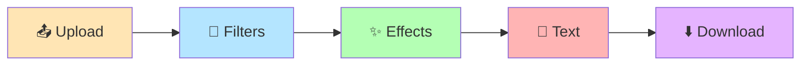

<div align="center">


[](https://tandev.foto)
[](LICENSE)
[](https://github.com/duongthaitan)

[](https://github.com/duongthaitan/tandev-foto-studio/stargazers)
[](https://github.com/duongthaitan/tandev-foto-studio/issues)

<p align="center">
  <a href="#-tính-năng-chính">Tính năng</a> •
  <a href="#-demo-live">Demo</a> •
  <a href="#-cài-đặt">Cài đặt</a> •
  <a href="#-hướng-dẫn-sử-dụng">Hướng dẫn</a> •
  <a href="#-đóng-góp">Contribute</a>
</p>

</div>

---

## 🎯 **Tandev.foto Studio**

**Công cụ chỉnh sửa ảnh online với phong cách film Fujifilm chuyên nghiệp**

<div align="center">

| 📸 **12 Film Filters** | 🤖 **AI Background Removal** | 📷 **Webcam Photobooth** | 🆓 **100% Miễn Phí** |
|:---:|:---:|:---:|:---:|
| Provia, Velvia, Chrome... | Remove.bg API | Chụp 1 hoặc 4 ảnh liên tiếp | Không quảng cáo, watermark |

</div>

### 🌟 **Highlights**



---

## 🚀 **Demo Live**

<div align="center">

[](https://tandev.foto)

*Không cần đăng ký - Chạy ngay trên browser*

</div>

---

## ✨ **Tính Năng Chính**

### 🎨 **Film Filters**
- **12 bộ lọc Fujifilm**: Provia, Velvia, Classic Chrome, Acros, Eterna...
- **Real-time preview** với chất lượng cao
- **One-click apply** cho tất cả ảnh

### 🎛️ **Professional Effects**  
- **Film Grain**: Hạt film chân thực (5 levels)
- **Light Leak**: Rò sáng nghệ thuật (8 styles)
- **Vignette**: Viền tối tập trung
- **AI Background**: Tách nền tự động

### 📝 **Text & Stickers**
- **20+ Google Fonts** chất lượng cao
- **Unlimited colors** với color picker
- **50+ stickers** đa dạng
- **Drag & drop** positioning

### 📷 **Photobooth Mode**
- **Single Shot**: Chụp 1 ảnh với timer
- **Photobooth**: Chụp 4 ảnh liên tiếp tự động
- **Webcam support** với live preview

### 🖼️ **Gallery Layouts**
- **Grid**: Lưới ảnh classic
- **Filmstrip**: Dải film ngang
- **Polaroid**: Style instant camera
- **Vertical**: Dải dọc photobooth

---

## 🛠️ **Tech Stack**

<div align="center">


**Libraries:** html2canvas, Remove.bg API, WebRTC

</div>

---

## 🚀 **Cài Đặt**

### 🌐 **Sử Dụng Online** *(Khuyến nghị)*
```bash
🔗 tandev.foto → 📸 Start using → ✅ Done!
```

### 💻 **Chạy Local**
```bash
# Clone repo
git clone https://github.com/duongthaitan/tandev-foto-studio.git

# Chạy local server
cd tandev-foto-studio
python -m http.server 8000

# Mở browser: localhost:8000
```

**Lưu ý**: Cần API key Remove.bg cho tính năng tách nền

---

## 🎮 **Hướng Dẫn Sử Dụng**

### **Quick Start:**
1. **📤 Upload ảnh** hoặc chụp từ webcam
2. **🎨 Chọn filter** Fujifilm yêu thích  
3. **✨ Thêm effects** (grain, light leak, vignette)
4. **📝 Tùy chỉnh text** và stickers
5. **⬇️ Download** gallery PNG chất lượng cao

### **Pro Tips:**
- ✅ Tick "Áp dụng cho tất cả" để chỉnh sửa hàng loạt
- 🖱️ Click khung ảnh để select (viền đỏ)
- 🎨 Try các layout khác nhau cho aesthetic tốt nhất
- 📱 Hoạt động tốt trên mobile browsers

---

## ❓ **FAQ**

<details>
<summary><b>🎨 Có những filter nào?</b></summary>

**12 Fujifilm Filters:**
- Provia (Natural & Vibrant)
- Velvia (Super Saturated)  
- Classic Chrome (Cool Vintage)
- Acros (B&W Film)
- Eterna (Cinema Look)
- + 7 filters khác

</details>

<details>
<summary><b>📸 Webcam không hoạt động?</b></summary>

- Allow camera permission trong browser
- Thử refresh page và allow lại
- Check Settings > Camera permissions
- Thử browser khác (Chrome recommended)

</details>

<details>
<summary><b>🤖 AI tách nền có giới hạn không?</b></summary>

- Free: 50 requests/month (Remove.bg API)
- Accuracy: ~90% với ảnh chất lượng tốt
- Hoạt động tốt với: portraits, objects rõ nét
- Khó với: tóc mỏng, nền phức tạp

</details>

---

## 🤝 **Đóng Góp**

<div align="center">

[](https://github.com/duongthaitan/tandev-foto-studio/stargazers)
[](https://github.com/duongthaitan/tandev-foto-studio/fork)
[](https://github.com/duongthaitan/tandev-foto-studio/issues)

</div>

**Contribution Guide:**
```bash
1. Fork repo
2. Create feature branch: git checkout -b feature/new-filter
3. Commit changes: git commit -m "Add vintage filter"
4. Push & create Pull Request
```

---

## 📞 **Liên Hệ**

<div align="center">

[](mailto:duongthaitan.dev@gmail.com)
[](https://tandev.foto)
[](https://github.com/duongthaitan)

</div>

---

## 📜 **License**

<div align="center">

[](LICENSE)

**MIT License - Free for personal & commercial use**

</div>

---

<div align="center">


### 📸 **Star nếu project hữu ích!**

[](https://github.com/duongthaitan/tandev-foto-studio)

**© 2024 Tandev.foto Studio - Film photography meets digital creativity**

</div>
